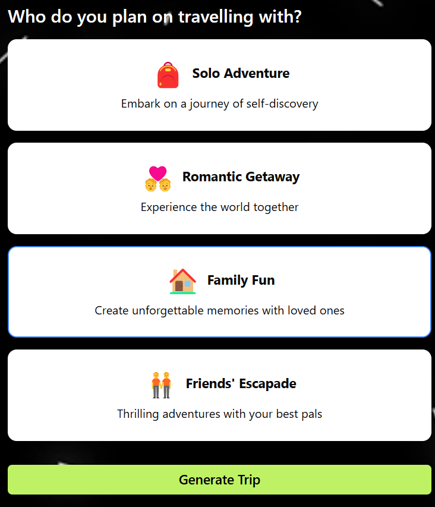

# Vyoageverse AI Trip Planner

This repository contains the code for an **AI-driven Trip Planner**, which generates customized trips with hotel recommendations and itineraries based on user budgets and travel preferences.

> ⚠️ **Note**: Due to the usage of Google Maps Places, Photos, and Geolocation APIs (which have cost limits), this project is **not deployed** to avoid exceeding a $200/month quota.

---

## ✨ Features

- 🌍 **Personalized Trips** – Generate trips tailored to your budget and travel choices.
- 🏨 **Hotel Recommendations** – Get hotel suggestions that fit your itinerary.
- 📅 **Dynamic Itineraries** – Itineraries are created based on user preferences and budgets.

---

## 📸 Screenshots

| Home Page | Travel Preferences | Plan |
|-----------|-------------------|--------------------|
|  |  |  |

| Hotel Recommendation | Day-wise Itinerary | Trip Summary |
|--------------|-------------------|--------------|
|  |  |  |

>

---

## 🚀 Getting Started

To run this project on your machine, follow these steps:

### 1. Clone the repository

```bash
git clone https://github.com/soloshowdown/Vyoageverse-ai-trip-planner.git
cd Vyoageverse-ai-trip-planner
